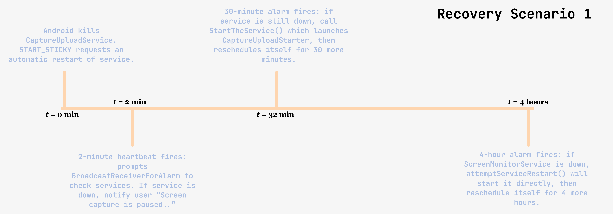
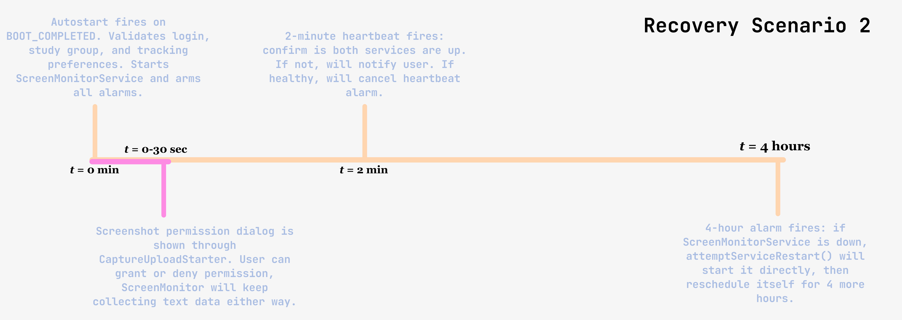
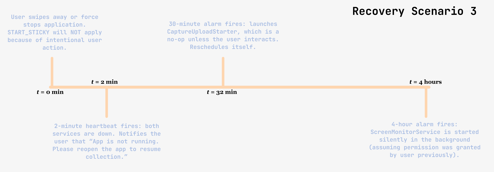

# Persistence and Scheduling

How the app ensures continuous data collection through service persistence, system alarms, and in-process timers.

## Overview

OpenUsage must collect data continuously, even when the user isn't actively using the app. This requires three complementary mechanisms working in concert:

1. **Service Persistence**: keeping the foreground service alive across app kills and reboots
2. **AlarmManager**: system-level scheduling that survives process death
3. **Handler.postDelayed**: lightweight in-process timers for frequent, recurring tasks

Together, these ensure the app wakes up, stays running, and keeps collecting data.

---

## 1. Service Persistence

### The Two-Service Architecture

OpenUsage uses two complementary foreground services to ensure resilience:

- **`ScreenMonitorService`**: the primary service. Collects text-based data (app usage, battery, network, location, activity). Runs for 5-6 hours, then auto-stops and reschedules itself. Lightweight and always available.
- **`CaptureUploadService`**: the enhancement layer. Adds screenshot capture on top of `ScreenMonitorService`. Requires user consent for MediaProjection. If it dies or is unavailable, `ScreenMonitorService` continues collecting text data.

The purpose of this redundancy is to capture data that might be missed when attempting to extract non-textual data. For example, when the user is consuming video content that contains little to no text.

### START_STICKY and Recovery

Both services return `START_STICKY` from `onStartCommand()`, which tells Android: *"If you kill me to reclaim memory, restart me automatically."* This is the first layer of recovery, but it's not guaranteed on low-memory devices.

### Boot Auto-Start

When the device boots, `AutostartService` (a boot receiver) fires and starts `ScreenMonitorService` immediately. It then attempts to start `CaptureUploadService` if the user has granted screenshot permissions. It also immediately sets up all three alarms to ensure continuous monitoring.

---

## 2. AlarmManager: System-Level Scheduling

### What is AlarmManager?

`AlarmManager` is Android's system-level scheduler. You tell it "wake up at time X and deliver this broadcast," and the OS handles it — even if the app is killed or the phone reboots. All alarms use `RTC_WAKEUP`, which wakes the device from sleep if needed.

### The Three Active Alarms

1. **2-Minute Heartbeat**: fires every 2 minutes to check if the service is alive
2. **30-Minute Re-Engagement Alarm**: fallback if the service dies unexpectedly
3. **4-Hour Re-Engagement Alarm**: longer safety net for extreme scenarios

### How Alarms Survive Reboots

The OS persists alarms across reboots. When the device boots, the alarms are automatically restored and resume firing on their original schedules.

---

## 3. The START_STICKY and Alarm Synergy: Overlapping Safety Nets

**Problem:** No single mechanism is 100% reliable. `START_STICKY` is automatic but not guaranteed. Alarms are reliable but need to be set up.

**Solution:** A two-layer redundancy system.

### Layer 1: START_STICKY (Automatic Recovery)

When Android kills the service, `START_STICKY` triggers an automatic restart. This is fast and transparent, no user intervention needed.

### Layer 2: AlarmManager Heartbeat (Guaranteed Wakeup)

Every 2 minutes, the OS delivers a broadcast to `BroadcastReceiverForAlarm`, which checks: *"Is `CaptureUploadService` running?"*

- If yes, do nothing (service is healthy).
- If no, notify the user: *"App is not running. Please reopen to resume."*

The 30-minute and 4-hour alarms provide additional safety nets if the 2-minute check fails.

### Layer 3: Boot Auto-Start (Survive Reboots)

On device boot, `AutostartService` starts the service and sets up all three alarms immediately.


### [INSERT DIAGRAM HERE]

A visual representation of the three layers and how they interact would go here.

---

## 4. Handler.postDelayed: In-Process Timers

### What is Handler?

`Handler` is a lightweight scheduler that runs code on a specific thread (usually the main thread or a background thread). Unlike `AlarmManager`, `Handler` timers die when the process dies — but they're cheap and precise for frequent, recurring tasks.

### Event Buffer Flushing

`EventOperationManager` uses a `ScheduledExecutorService` to flush the in-memory event buffer to SQLite every 60 seconds. This batching reduces database writes and improves performance.

### Screenshot Uploader

`ScreenshotCapture` uses a `Handler` to reschedule the uploader every `notTextInterval` milliseconds (e.g. every few minutes). The uploader reschedules itself after each run.

### Self-Rescheduling Pattern

Both the event flusher and screenshot uploader follow the same pattern:

```
handler.postDelayed(runnable, delayMillis);  // Schedule first run
// Inside the runnable:
//   ... do work ...
//   handler.postDelayed(this, delayMillis);  // Reschedule self
```

This creates a self-perpetuating loop as long as the service is alive.

---

## 5. BroadcastReceiverForAlarm: The Alarm Handler

When an alarm fires, the OS delivers a broadcast to `BroadcastReceiverForAlarm.onReceive()`. The receiver extracts the `request_code` from the Intent and dispatches accordingly.

This implementation is mostly left untouched from the Screenomics team's original robust alarm-handling architecture, retaining their core logic while adding OpenUsage-specific modifications (e.g., study group checks in `AutostartService`).

### The 2-Minute Heartbeat (request_code=0)

This is the main health check, evaluating three distinct scenarios:

1. **if (screenshots_enabled && !CaptureUploadService.isRunning() && ScreenMonitorService.isRunning())**
   - Notifies user: "Screen capture is paused. Please reopen the app to resume."
   - Rationale: `ScreenMonitorService` is collecting text data, but screenshot fallback is unavailable.

2. **else if (screenshots_enabled && !CaptureUploadService.isRunning() && !ScreenMonitorService.isRunning())**
   - Notifies user: "App is not running. To resume data collection, please reopen the app."
   - Rationale: No collection is happening.

3. **else (both services UP)**
   - Cancels the alarm (no need to keep checking).
   - Rationale: Everything is healthy.

### The 30-Minute Re-Engagement Alarm (request_code=5)

If `CaptureUploadService` is still down after 2-minute checks:

- Attempts to restart the service via `StartTheService(context)`
- Reschedules itself for another 30 minutes
- Cancels itself if the service comes back up

### The 4-Hour Re-Engagement Alarm (request_code=6)

The longest safety net:

- Checks if `ScreenMonitorService` is running
- If down, attempts to restart it
- Always reschedules itself for 4 more hours

### Key Design Note

The receiver primarily **checks and notifies** rather than directly restarting services. Users must reopen the app to resume collection. The alarms function as reminders and health checks, not automatic recovery mechanisms. This respects user agency while ensuring visibility into collection status.

---

## 6. Failure Scenarios and Recovery

### Scenario 1: Service Killed by Android

This is the most common failure. Under memory pressure, Android terminates `CaptureUploadService` to reclaim resources. Because the service returns `START_STICKY`, the OS attempts an automatic restart almost immediately, and in most cases collection resumes with no user intervention. The alarm layers exist as a safety net: if `START_STICKY` fails to bring the service back, the 2-minute heartbeat detects the outage and notifies the user, while the 30-minute and 4-hour alarms make escalating restart attempts.



### Scenario 2: Device Reboots

On reboot, no service survives, so recovery depends entirely on the boot receiver. `AutostartService` fires on `BOOT_COMPLETED`, validates that the user is logged in, is not in the PASSIVE study group, and has not manually disabled tracking. If all checks pass, it starts `ScreenMonitorService`, launches the screenshot-permission flow via `CaptureUploadStarter`, and arms all three alarms. From that point on, the standard heartbeat/re-engagement cycle takes over.



### Scenario 3: User Explicitly Stops the App

When the user swipes the app away or force-stops it, this is treated as an intentional action, so `START_STICKY` does **not** trigger a restart. The app deliberately does not fight the user here. Instead, the alarm layer surfaces reminders that collection has stopped, and only the longest (4-hour) alarm silently restarts the background text-collection service.



---

## Related Documentation

- `TIMESTAMPING_AND_TIME_SYNC.md`: how events are timestamped and server time is synchronized
- `README.md`: architecture overview
